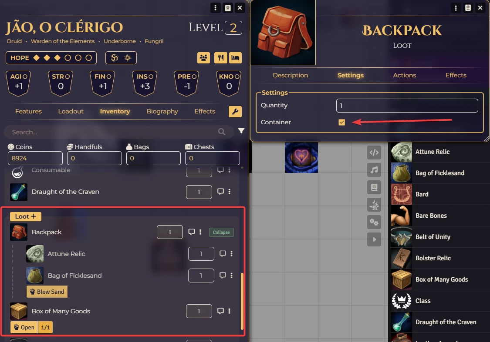

# DH Containers

A simple inventory organizer for Daggerheart on Foundry VTT. Turn any loot item into a visual container and drag weapons, armor, consumables, or other loot inside it.

### Why?

Daggerheart character sheets show all items in a flat list. As your inventory grows, it becomes hard to find things. DH Containers lets you group related items together — put potions in a pouch, weapons in a chest, or travel gear in a backpack. Click to collapse and declutter your sheet.

### How to Use

1. **Mark a container:** Open any loot item, go to the **Settings** tab, and check **Container**.
2. **Add items:** Drag any weapon, armor, consumable, or loot item onto the container in your inventory.
3. **Collapse/Expand:** Click the button on the container row to hide or show its contents.
4. **Remove items:** Drag an item out of the container and drop it elsewhere in the inventory.

<p align="center">
  
</p>

> This is purely visual — items are not physically moved or modified. It just organizes how they appear on the sheet.

### Installation

Import this manifest URL in Foundry's module installer:

```
https://raw.githubusercontent.com/brunocalado/dh-containers/main/module.json
```

# License

* **Code License:** GNU GPLv3.

**Disclaimer:** This module is an independent creation and is not affiliated with Darrington Press.

**Disclaimer:** This is a fork from this [Link](https://github.com/ivan-hr/swade-containers).

# 🧰 My Daggerheart Modules

| Module | Description |
| :--- | :--- |
| 💀 [**Adversary Manager**](https://github.com/brunocalado/daggerheart-advmanager) | Scale adversaries instantly and build balanced encounters in Foundry VTT. |
| 💥 [**Critical**](https://github.com/brunocalado/daggerheart-critical) | Animated Critical. |
| 💠 [**Custom Stat Tracker**](https://github.com/brunocalado/dh-new-stat-tracker) | Add custom trackers to actors. |
| ☠️ [**Death Moves**](https://github.com/brunocalado/daggerheart-death-moves) | Enhances the Death Move moment with immersive audio and visual effects. |
| 📏 [**Distances**](https://github.com/brunocalado/daggerheart-distances) | Visualizes combat ranges with customizable rings and hover calculations. |
| 📦 [**Extra Content**](https://github.com/brunocalado/daggerheart-extra-content) | Homebrew for Daggerheart. |
| 🤖 [**Fear Macros**](https://github.com/brunocalado/daggerheart-fear-macros) | Automatically executes macros when the Fear resource is changed. |
| 😱 [**Fear Tracker**](https://github.com/brunocalado/daggerheart-fear-tracker) | Adds an animated slider bar with configurable fear tokens to the UI. |
| 🎁 [**Mystery Box**](https://github.com/brunocalado/dh-mystery-box) | Introduces mystery box mechanics for random loot and surprises. |
| ⚡ [**Quick Actions**](https://github.com/brunocalado/daggerheart-quickactions) | Quick access to common mechanics like Falling Damage, Downtime, etc. |
| 📜 [**Quick Rules**](https://github.com/brunocalado/daggerheart-quickrules) | Fast and accessible reference guide for the core rules. |
| 🎲 [**Stats**](https://github.com/brunocalado/daggerheart-stats) | Tracks dice rolls from GM and Players. |
| 🧠 [**Stats Toolbox**](https://github.com/brunocalado/dh-statblock-importer) | Import using a statblock. |
| 🛒 [**Store**](https://github.com/brunocalado/daggerheart-store) | A dynamic, interactive, and fully configurable store for Foundry VTT. |

# 🗺️ Adventures

| Adventure | Description |
| :--- | :--- |
| ✨ [**I Wish**](https://github.com/brunocalado/i-wish-daggerheart-adventure) | A wealthy merchant is cursed; one final expedition may be the only hope. |
| 💣 [**Suicide Squad**](https://github.com/brunocalado/suicide-squad-daggerheart-adventure) | Criminals forced to serve a ruthless master in a land on the brink of war. |
